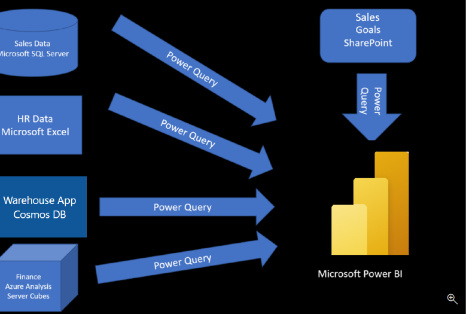

## Intro

In this module’s scenario, you work for Tailwind Traders. You’ve been tasked by senior leadership to create a suite of reports that are dependent on data in several different locations. The database that tracks sales transactions is in SQL Server, a relational database that contains what items each customer bought and when. It also tracks which employee made the sale, along with the employee name and employee ID. However, that database doesn’t contain the employee’s hire date, their title, or who their manager is. For that information, you need to access files that Human Resources keeps in Excel. You've been consistently requesting that they use an SQL database, but they haven't yet had the chance to implement it.

When an item ships, the shipment is recorded in the warehousing application, which is new to the company. The developers chose to store data in Cosmos DB, as a set of JSON documents.

Tailwind Traders has an application that helps with financial projections, so that they can predict what their sales will be in future months and years, based on past trends. Those projections are stored in Microsoft Azure Analysis Services. Here’s a view of the many data sources you're asked to combine data from.

Before you can create reports, you must first extract data from the various data sources. Interacting with SQL Server is different from Excel, so you should learn the nuances of both systems. After gaining understanding of the systems, you can use Power Query to help you clean the data, such as renaming columns, replacing values, removing errors, and combining query results. Power Query is also available in Excel. After the data has been cleaned and organized, you're ready to build reports in Power BI. Finally, you'll publish your combined semantic model and reports to Power BI service. From there, other people can use your semantic model and build their own reports or they can use the reports you’ve already built. Additionally, if someone else built a semantic model you'd like to use, you can build reports from that too!

## Get data from files

Organizations often export and store data in files. One possible file format is a flat file. A flat file is a type of file that has only one data table and every row of data is in the same structure. The file doesn't contain hierarchies. Likely, you're familiar with the most common types of flat files, which are comma-separated values (.csv) files, delimited text (.txt) files, and fixed width files.

### Scenario

The Human Resources (HR) team at Tailwind Traders has prepared a flat file that contains some of your organization's employee data, such as employee name, hire date, position, and manager. They've requested that you build Power BI reports by using this data, and data that is located in several other data sources.

### Flat file location

Your Excel files might exist in one of the following locations:

- Local.
- OneDrive for Business.
- OneDrive - Personal.
- SharePoint - Team Sites.

### Change the source file

You might have to change the location of a source file for a data source during development, or if a file storage location changes. To keep your reports up to date, you'll need to update your file connection paths in Power BI.

Power Query provides many ways for you to accomplish this task, so that you can make this type of change when needed. For instance:

1. Data source settings
2. Query settings
3. Advanced Editor

## Get data from relational sources

If your organization uses a relational database for sales, you can use Power BI Desktop to connect directly to the database instead of using exported flat files.

### Scenario

The Sales team at Tailwind Traders has requested that you connect to the organization's on-premises SQL Server database and get the sales data into Power BI Desktop so you can build sales reports.

### Connect to data in relational DB

After you've added your server and database names, you'll be prompted to sign in with a username and password. You'll have three sign-in options:

- **Windows account**
- **DB credentials**
- **Microsoft account**

### Import data by writing an SQL query

Another way you can import data is to write an SQL query to specify only the tables and columns that you need.

To write your SQL query, on the **SQL Server database** window, enter your server and database names, and then select the arrow next to **Advanced options** to expand this section and view your options.
